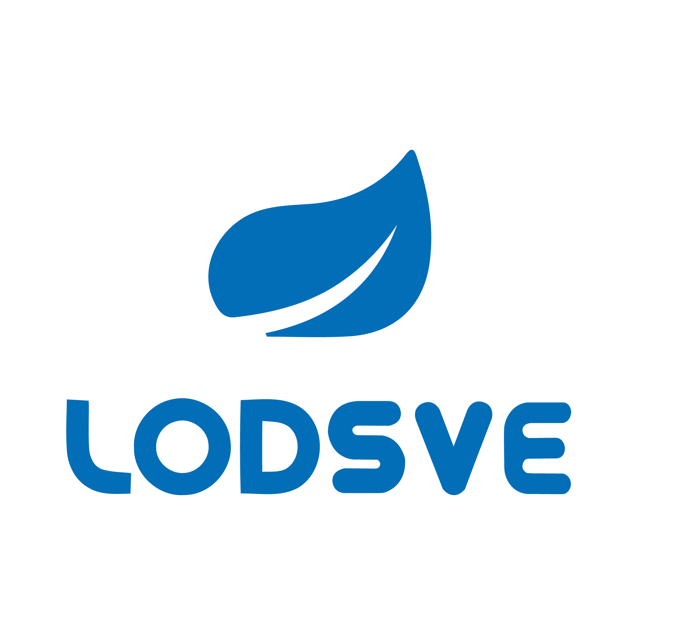

## lodsve-framework
My development tools, it encapsulates some open source projects, and better facilitate the conduct of Java Web development.

## What is `lodsve`
`lodsve` is the short of `Let our development of Spring very easy!`.

## Simple Introduction
1. Base on some open source framework. It encapsulates some classes and methods to make more convenient for developers.
2. It consists of the following modules:
    - lodsve-3rd
    - lodsve-amqp
    - lodsve-cache
    - lodsve-core
    - lodsve-dubbo
    - lodsve-fs
    - lodsve-mongodb
    - lodsve-mvc
    - lodsve-mybatis
    - lodsve-redis
    - lodsve-search
    - lodsve-security
    - lodsve-test
    - lodsve-transaction
    - lodsve-validate
    - lodsve-wechat
    - lodsve-workflow

## How To Use

    <dependency>
        <groupId>com.github.lodsve</groupId>
        <artifactId>lodsve-framework</artifactId>
        <version>${lodsve.version}</version>
        <type>pom</type>
        <scope>import</scope>
    </dependency>

## Check out sources
`git clone git@github.com:lodsve/lodsve-framework.git`

## Check out demos
`git clone git@github.com:lodsve/lodsve-demo.git`

## Check out the configurations
`git clone git@github.com:lodsve/lodsve-configs.git`

## Import sources into your IDE
Run command `mvn idea:idea` or `mvn eclipse:eclipse` in the root folder.
> **Note:** Per the prerequisites above, ensure that you have JDK 7 and Maven 3.3.X configured properly in your IDE.

## Change History
[CHANGELOG][]

## Contact me
1. Email: sunhao.java@gmail.com
2. QQ: [867885140][]
3. Blog: [Blog][] [OSChina][]

## License
The `Lodsve Framework` is released under version 2.0 of the [Apache License][].

## Donate

[Apache License]: http://www.apache.org/licenses/LICENSE-2.0
[CHANGELOG]: https://github.com/lodsve/lodsve-framework/blob/master/CHANGELOG.md
[Blog]: http://sunhao.lodsve.com
[OSChina]: http://my.oschina.net/sunhaojava/blog
[867885140]: http://wpa.qq.com/msgrd?v=3&uin=867885140&site=qq&menu=yes